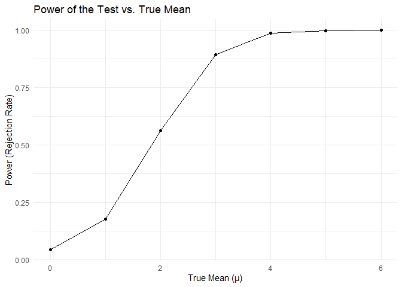
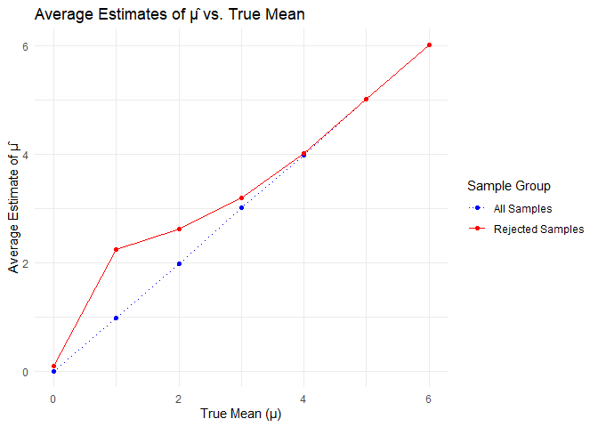
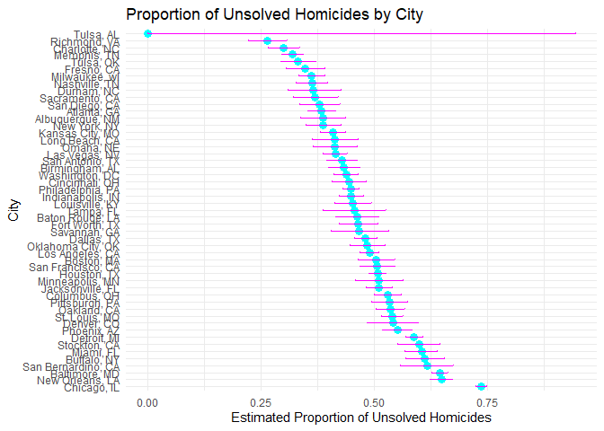

Solutions for hw 5
================
2024-11-16

``` r
# Function to simulate data and compute statistics
generate_data <- function(mean_value, sample_size, sd, num_iterations) {
  data <- tibble(
    iteration = 1:num_iterations,
    sample = replicate(num_iterations, rnorm(sample_size, mean = mean_value, sd = sd), simplify = FALSE)
  ) |>
  mutate(
    sample_mean = map_dbl(sample, mean),
    test_result = map(sample, ~ broom::tidy(t.test(.x, mu = 0))),
    p_value = map_dbl(test_result, "p.value")
  )
  
  return(data)
}

# Specify mean values for the simulations
mu_values <- c(0, 1, 2, 3, 4, 5, 6)

# Run simulations for each mean value
simulations <- lapply(mu_values, function(mu) {
  generate_data(mu, n, sigma, iterations)
})

# Combine results into a single data frame
simulation_results <- bind_rows(lapply(1:length(mu_values), function(i) {
  simulations[[i]] |>
    mutate(true_mean = mu_values[i])
}))
```

``` r
# Calculate power (rejection rate) for each true mean value
power_data <- simulation_results |>
  group_by(true_mean) |>
  summarize(power = mean(p_value < alpha))

# Plot power vs. true mean
ggplot(power_data, aes(x = true_mean, y = power)) +
  geom_line() +
  geom_point() +
  labs(title = "Power of the Test vs. True Mean", x = "True Mean (μ)", y = "Power (Rejection Rate)") +
  theme_minimal()
```

<!-- -->

As the true value of mu increases (the effect size becomes larger), the
power of the test also increases. Reason: Larger effect sizes are easier
to detect, making it more likely that the test will correctly reject the
null hypothesis.

``` r
# Calculate average estimates
avg_estimates <- simulation_results |>
  group_by(true_mean) |>
  summarize(
    avg_estimate_all = mean(sample_mean),
    avg_estimate_rejected = mean(sample_mean[p_value < alpha])
  )

# Plot average estimates
ggplot(avg_estimates, aes(x = true_mean)) +
  geom_line(aes(y = avg_estimate_all, color = "All Samples"), linetype = "dotted") +
  geom_point(aes(y = avg_estimate_all, color = "All Samples")) +
  geom_line(aes(y = avg_estimate_rejected, color = "Rejected Samples"), linetype = "solid") +
  geom_point(aes(y = avg_estimate_rejected, color = "Rejected Samples")) +
  labs(title = "Average Estimates of μ̂ vs. True Mean", x = "True Mean (μ)", y = "Average Estimate of μ̂", color = "Sample Group") +
  scale_color_manual(values = c("All Samples" = "blue", "Rejected Samples" = "red")) +
  theme_minimal()
```

<!-- -->

For high value of mu: Both averages converge. (From what we see this
occurs for mu =\> 4) The sample average𝜇cap across tests where the null
hypothesis is rejected is not approximately equal to the true 𝜇 for
small 𝜇 values due to selection bias. The rejection of null hypothesis
selects for larger observed effects. For larger𝜇, the average in
rejected samples converges with the true 𝜇, reflecting the significant
effect size that consistently leads to the null hypothesis being
rejected.

``` r
hom_data = read.csv("homicide-data.csv")|>
  janitor::clean_names()
```

Description of the data: Contains 52179 observations and has 12
variables. These observations are the records of the homicide variables
and each variable gives us the information of the corresponding case.
Example, city variable gives us the city where the incident was
recorded, victim_sex gives us the sex of the victim of the homicide etc.

``` r
hom_data2 = hom_data |>
  mutate(city_state = paste(city, state, sep = ", ")) |>
  group_by(city_state) |>
  summarize(
    total_homicides = n(),
    unsolved_homicides = sum(disposition %in% c("Closed without arrest", "Open/No arrest")))

hom_data2 |> 
  head(8) |> #showing some observations to show that our code words
  knitr::kable()
```

| city_state      | total_homicides | unsolved_homicides |
|:----------------|----------------:|-------------------:|
| Albuquerque, NM |             378 |                146 |
| Atlanta, GA     |             973 |                373 |
| Baltimore, MD   |            2827 |               1825 |
| Baton Rouge, LA |             424 |                196 |
| Birmingham, AL  |             800 |                347 |
| Boston, MA      |             614 |                310 |
| Buffalo, NY     |             521 |                319 |
| Charlotte, NC   |             687 |                206 |

``` r
balt_data = hom_data2 |>
  filter(city_state == "Baltimore, MD")
balt_test = prop.test(balt_data$unsolved_homicides, balt_data$total_homicides) |>
  broom::tidy()
conf_int_balt = c(balt_test$conf.low[1], balt_test$conf.high[1])
conf_int_df <- data.frame( "Confidence Interval" = conf_int_balt, row.names = c("Low", "High") ) # Print the confidence interval as a table
print("The confidence interval for Baltimore, MD is:") 
```

    ## [1] "The confidence interval for Baltimore, MD is:"

``` r
knitr::kable(conf_int_df)
```

|      | Confidence.Interval |
|:-----|--------------------:|
| Low  |           0.6275625 |
| High |           0.6631599 |

``` r
# Apply prop.test for each city and tidy the results
results2 = hom_data2 |>
  mutate(
    test_results = map2(unsolved_homicides, total_homicides, ~ broom::tidy(prop.test(.x, .y)))
  ) |>
  unnest(test_results) |>
  select(city_state, estimate, conf.low, conf.high) |>
  janitor::clean_names() |>
  arrange(desc(estimate)) |>
  mutate(city_state = factor(city_state, levels = city_state))
```

    ## Warning: There was 1 warning in `mutate()`.
    ## ℹ In argument: `test_results = map2(...)`.
    ## Caused by warning in `prop.test()`:
    ## ! Chi-squared approximation may be incorrect

``` r
head(results2, n = 5)|>
  knitr::kable()
```

| city_state         |  estimate |  conf_low | conf_high |
|:-------------------|----------:|----------:|----------:|
| Chicago, IL        | 0.7358627 | 0.7239959 | 0.7473998 |
| New Orleans, LA    | 0.6485356 | 0.6231048 | 0.6731615 |
| Baltimore, MD      | 0.6455607 | 0.6275625 | 0.6631599 |
| San Bernardino, CA | 0.6181818 | 0.5576628 | 0.6753422 |
| Buffalo, NY        | 0.6122841 | 0.5687990 | 0.6540879 |

``` r
# Create the plot with error bars
ggplot(results2, aes(x = city_state, y = estimate)) +
  geom_point(size = 3, color = "cyan") +
  geom_errorbar(aes(ymin = conf_low, ymax = conf_high), width = 0.2, color = "magenta") +
  labs(title = "Proportion of Unsolved Homicides by City",
       x = "City",
       y = "Estimated Proportion of Unsolved Homicides") +
  theme_minimal() +
  coord_flip()  # Flip coordinates for better readability
```

<!-- -->
